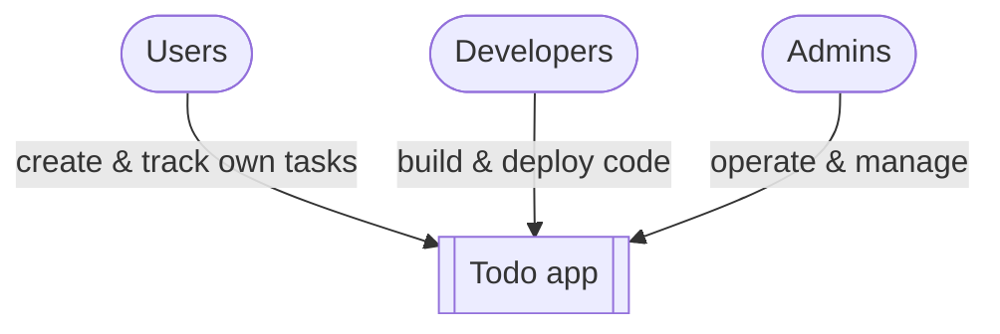

# Context Diagram

The Todo app as a single monolithic process. External entities that interact with it.

| Entity | Role | Interaction |
|--------|------|-------------|
| Users | End users tracking their own tasks | CRUD their own tasks via the API/frontend |
| Developers | Build and ship the app | Commit code, run CI/CD, deploy |
| Admins | Operate and maintain the running system | Infra/DB management, support |

> Entity list is incomplete — more to add.
