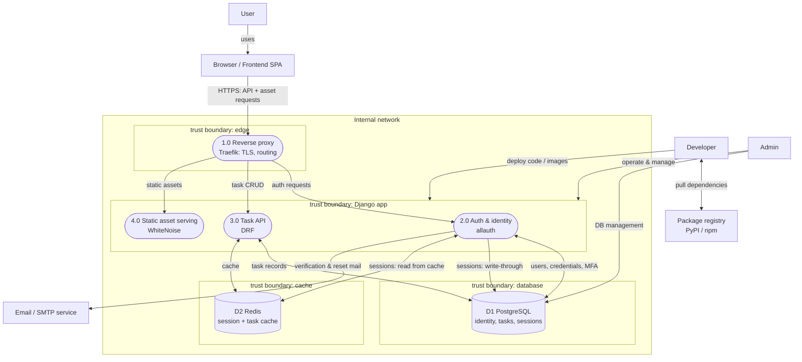

# Level 1 DFD

Decomposes the monolithic `Todo` process from the [context diagram](context-diagram.md) into its
component processes, data stores, and the external entities they exchange data with.

## Processes

| # | Process | Responsibility |
|---|---------|----------------|
| 1.0 | Reverse proxy (Traefik) | TLS termination, routing into the app |
| 2.0 | Auth & identity (allauth) | Registration, login, MFA, email verification, password reset |
| 3.0 | Task API (DRF) | CRUD on tasks, scoped to the authenticated user |
| 4.0 | Static asset serving (WhiteNoise) | Serves Django/DRF static assets |

## Data stores

| # | Store | Holds |
|---|-------|-------|
| D1 | PostgreSQL | Identity (emails, password hashes, MFA secrets), task records, sessions (source of truth) |
| D2 | Redis | Cache: read-optimized sessions (write-through), task cache |

## Trust boundaries

Ranked by priority. The perimeter boundaries carry untrusted input and are the primary attack
surface; internal boundaries are defense-in-depth, only reachable after a foothold.

**High — perimeter**
- Internet ↔ edge: external entities (User/Browser) → reverse proxy (1.0). Primary attack surface (→ D1).
- Build/deploy: Developer/registry → Django app. Supply chain (→ D2).

**Low — internal (defense-in-depth)**

Each internal component is its own trust zone — the Django app doesn't implicitly trust the proxy,
DB, or cache, and vice versa — but these are only in play once an attacker is already inside.

- Edge ↔ Django app: proxy → processes 2.0–4.0.
- Django app ↔ database: 2.0/3.0 → PostgreSQL (D1).
- Django app ↔ cache: 2.0/3.0 → Redis (D2).

## Open

- Frontend served **same-origin** behind the reverse proxy (no CORS). Build/serving details TBD when
  the frontend lands.
